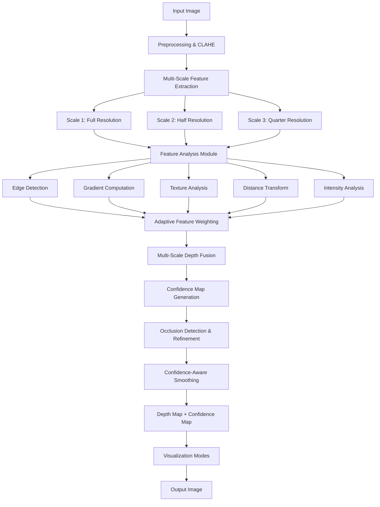
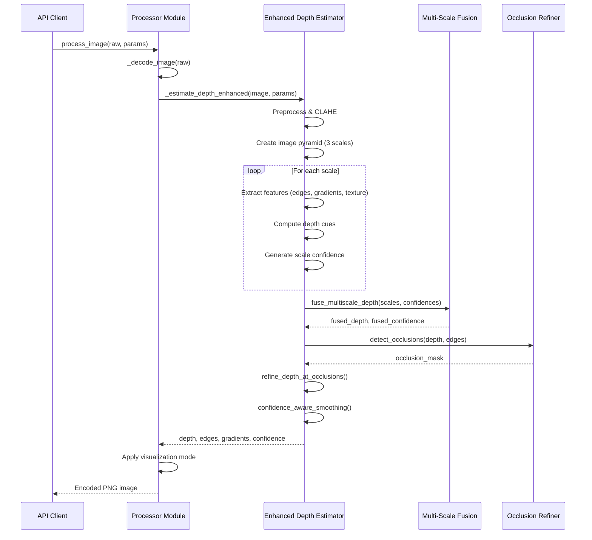

# Design Document: Accurate Depth Scanner

## Overview

The current DepthScan system uses classical computer vision techniques (edge detection, gradient analysis, distance transforms, texture analysis) to generate depth maps from 2D images. While functional, the depth estimation lacks accuracy in complex scenes with multiple depth layers, occlusions, and varying lighting conditions. This design proposes an enhanced depth estimation algorithm that incorporates multi-scale analysis, adaptive feature weighting, occlusion handling, and confidence-aware depth fusion to significantly improve accuracy without sacrificing output quality.

The enhancement will maintain the existing API interface and processing pipeline while replacing the core `_estimate_depth()` function with a more sophisticated multi-stage depth estimation algorithm. The new approach combines evidence from multiple scales and features, adaptively weights contributions based on local image characteristics, and produces both depth maps and confidence maps to enable quality-aware post-processing.

## Architecture




The architecture follows a multi-stage pipeline:
1. **Preprocessing**: Convert to grayscale and apply CLAHE for contrast enhancement
2. **Multi-Scale Feature Extraction**: Process image at multiple resolutions to capture both fine details and broad structure
3. **Feature Analysis**: Extract depth cues from edges, gradients, texture, distance transforms, and intensity
4. **Adaptive Weighting**: Dynamically adjust feature contributions based on local image characteristics
5. **Multi-Scale Fusion**: Combine depth estimates from different scales with confidence weighting
6. **Occlusion Refinement**: Detect and handle depth discontinuities at object boundaries
7. **Confidence-Aware Smoothing**: Apply smoothing selectively based on confidence maps to preserve sharp edges


## Main Algorithm/Workflow




## Components and Interfaces

### Component 1: Enhanced Depth Estimator

**Purpose**: Replace the existing `_estimate_depth()` function with a sophisticated multi-scale depth estimation algorithm.

**Interface**:
```python
def _estimate_depth_enhanced(
    image: np.ndarray, 
    params: ProcessingParams
) -> tuple[np.ndarray, np.ndarray, np.ndarray, np.ndarray]:
    """
    Estimate depth using multi-scale analysis and adaptive feature weighting.
    
    Args:
        image: Input BGR image (H x W x 3)
        params: Processing parameters controlling algorithm behavior
        
    Returns:
        depth: Normalized depth map (H x W, float32, range [0, 1])
        edges: Binary edge map (H x W, uint8)
        gradients: Gradient magnitude map (H x W, float32, range [0, 1])
        confidence: Depth confidence map (H x W, float32, range [0, 1])
    """
    pass
```

**Responsibilities**:
- Convert image to grayscale and apply CLAHE
- Build image pyramid at multiple scales
- Extract depth cues from multiple features
- Fuse multi-scale depth estimates
- Detect and refine occlusions
- Generate confidence maps
- Apply confidence-aware smoothing

### Component 2: Multi-Scale Feature Extractor

**Purpose**: Extract depth-relevant features at multiple scales to capture both fine details and global structure.

**Interface**:
```python
@dataclass
class ScaleFeatures:
    """Features extracted at a single scale"""
    scale: float
    edges: np.ndarray
    gradients: np.ndarray
    texture: np.ndarray
    distance_depth: np.ndarray
    intensity_depth: np.ndarray
    confidence: np.ndarray

def _extract_scale_features(
    gray: np.ndarray,
    scale: float,
    params: ProcessingParams
) -> ScaleFeatures:
    """
    Extract depth features at a specific scale.
    
    Args:
        gray: Grayscale image with CLAHE applied
        scale: Scale factor (1.0 = full res, 0.5 = half res, etc.)
        params: Processing parameters
        
    Returns:
        ScaleFeatures object containing all extracted features
    """
    pass
```

**Responsibilities**:
- Resize image to target scale
- Compute edges using Canny detector
- Calculate gradient magnitude using Sobel
- Analyze texture using Laplacian
- Generate distance-based depth cues
- Compute intensity-based depth
- Estimate feature confidence


### Component 3: Adaptive Feature Weighting Module

**Purpose**: Dynamically adjust the contribution of each depth cue based on local image characteristics to improve robustness.

**Interface**:
```python
@dataclass
class AdaptiveWeights:
    """Spatially-varying weights for depth feature fusion"""
    distance_weight: np.ndarray  # Weight for distance transform cue
    intensity_weight: np.ndarray  # Weight for intensity-based depth
    gradient_weight: np.ndarray  # Weight for gradient information
    texture_weight: np.ndarray   # Weight for texture analysis

def _compute_adaptive_weights(
    features: ScaleFeatures,
    params: ProcessingParams
) -> AdaptiveWeights:
    """
    Compute spatially-varying weights for depth feature fusion.
    
    Weights are adjusted based on:
    - Edge proximity (edges favor distance transform)
    - Texture richness (texture areas favor gradient/texture cues)
    - Illumination uniformity (uniform areas favor intensity)
    
    Args:
        features: Extracted features at current scale
        params: Processing parameters
        
    Returns:
        AdaptiveWeights with spatially-varying weight maps
    """
    pass
```

**Responsibilities**:
- Analyze local image characteristics
- Compute reliability scores for each depth cue
- Generate spatially-varying weight maps
- Normalize weights to sum to 1.0

### Component 4: Multi-Scale Depth Fusion

**Purpose**: Combine depth estimates from multiple scales using confidence-weighted averaging.

**Interface**:
```python
def _fuse_multiscale_depth(
    scale_depths: list[np.ndarray],
    scale_confidences: list[np.ndarray],
    target_shape: tuple[int, int]
) -> tuple[np.ndarray, np.ndarray]:
    """
    Fuse depth maps from multiple scales using confidence weighting.
    
    Args:
        scale_depths: List of depth maps at different scales
        scale_confidences: List of confidence maps at different scales
        target_shape: Target output shape (height, width)
        
    Returns:
        fused_depth: Combined depth map at target resolution
        fused_confidence: Combined confidence map
    """
    pass
```

**Responsibilities**:
- Resize all scale outputs to target resolution
- Normalize confidence values across scales
- Perform weighted averaging with confidence weights
- Propagate confidence to fused output


### Component 5: Occlusion Detection & Refinement

**Purpose**: Detect depth discontinuities at object boundaries and refine depth estimates in these regions to prevent blurring across occlusion boundaries.

**Interface**:
```python
def _detect_occlusions(
    depth: np.ndarray,
    edges: np.ndarray,
    gradient_threshold: float = 0.15
) -> np.ndarray:
    """
    Detect occlusion boundaries where depth changes rapidly.
    
    Args:
        depth: Initial depth map
        edges: Binary edge map from image
        gradient_threshold: Threshold for depth gradient magnitude
        
    Returns:
        occlusion_mask: Binary mask where 1 indicates occlusion boundary
    """
    pass

def _refine_depth_at_occlusions(
    depth: np.ndarray,
    occlusion_mask: np.ndarray,
    features: ScaleFeatures
) -> np.ndarray:
    """
    Refine depth values near occlusion boundaries using local features.
    
    Args:
        depth: Initial depth map
        occlusion_mask: Binary occlusion boundary mask
        features: Original image features for guidance
        
    Returns:
        refined_depth: Depth map with improved occlusion handling
    """
    pass
```

**Responsibilities**:
- Compute depth gradients
- Identify rapid depth changes
- Correlate with image edges
- Apply edge-preserving refinement
- Maintain sharp boundaries

### Component 6: Confidence-Aware Smoothing

**Purpose**: Apply smoothing selectively based on confidence maps to reduce noise while preserving high-confidence edges and details.

**Interface**:
```python
def _confidence_aware_smoothing(
    depth: np.ndarray,
    confidence: np.ndarray,
    params: ProcessingParams
) -> np.ndarray:
    """
    Apply adaptive smoothing based on confidence values.
    
    High-confidence regions (edges, features) receive minimal smoothing.
    Low-confidence regions (uniform areas, ambiguous depths) receive more smoothing.
    
    Args:
        depth: Depth map to smooth
        confidence: Confidence map (higher = more reliable)
        params: Processing parameters controlling smoothing amount
        
    Returns:
        smoothed_depth: Adaptively smoothed depth map
    """
    pass
```

**Responsibilities**:
- Map confidence to smoothing strength
- Apply bilateral filtering with adaptive parameters
- Preserve high-confidence features
- Reduce noise in low-confidence regions


## Data Models

### Model 1: ScaleFeatures

```python
@dataclass
class ScaleFeatures:
    """Features extracted at a single scale in the image pyramid"""
    scale: float  # Scale factor relative to original (1.0, 0.5, 0.25)
    edges: np.ndarray  # Binary edge map (H x W, uint8)
    gradients: np.ndarray  # Gradient magnitude (H x W, float32, [0, 1])
    texture: np.ndarray  # Texture strength (H x W, float32, [0, 1])
    distance_depth: np.ndarray  # Distance transform depth (H x W, float32, [0, 1])
    intensity_depth: np.ndarray  # Intensity-based depth (H x W, float32, [0, 1])
    confidence: np.ndarray  # Feature confidence (H x W, float32, [0, 1])
```

**Validation Rules**:
- `scale` must be positive (typically 1.0, 0.5, or 0.25)
- All array dimensions must match (H x W)
- `edges` must be binary (0 or 255)
- All float32 arrays must be normalized to [0, 1] range
- `confidence` should be non-negative

### Model 2: AdaptiveWeights

```python
@dataclass
class AdaptiveWeights:
    """Spatially-varying weights for depth feature fusion"""
    distance_weight: np.ndarray  # Weight for distance transform (H x W, float32)
    intensity_weight: np.ndarray  # Weight for intensity depth (H x W, float32)
    gradient_weight: np.ndarray  # Weight for gradient info (H x W, float32)
    texture_weight: np.ndarray  # Weight for texture info (H x W, float32)
```

**Validation Rules**:
- All arrays must have identical shape (H x W)
- All values must be non-negative
- At each pixel, weights should sum to approximately 1.0
- Weights must be float32 type

### Model 3: DepthEstimationResult

```python
@dataclass
class DepthEstimationResult:
    """Complete result from enhanced depth estimation"""
    depth: np.ndarray  # Final depth map (H x W, float32, [0, 1])
    edges: np.ndarray  # Binary edge map (H x W, uint8)
    gradients: np.ndarray  # Gradient magnitude (H x W, float32, [0, 1])
    confidence: np.ndarray  # Depth confidence (H x W, float32, [0, 1])
```

**Validation Rules**:
- All arrays must have matching spatial dimensions
- `depth` must be normalized to [0, 1] where 0 = closest, 1 = farthest
- `edges` must be binary (0 or 255)
- `gradients` and `confidence` must be normalized to [0, 1]
- No NaN or Inf values allowed


## Key Functions with Formal Specifications

### Function 1: _estimate_depth_enhanced()

```python
def _estimate_depth_enhanced(
    image: np.ndarray, 
    params: ProcessingParams
) -> tuple[np.ndarray, np.ndarray, np.ndarray, np.ndarray]:
    """Enhanced multi-scale depth estimation with confidence maps"""
    pass
```

**Preconditions:**
- `image` is a valid BGR numpy array with shape (H, W, 3) where H, W > 0
- `image.dtype` is uint8
- `params` is a valid ProcessingParams instance
- `params.edge_sensitivity`, `params.depth_contrast`, `params.smoothing` are in [0, 100]

**Postconditions:**
- Returns tuple (depth, edges, gradients, confidence)
- `depth` has shape (H, W), dtype float32, all values in [0, 1]
- `edges` has shape (H, W), dtype uint8, values are 0 or 255
- `gradients` has shape (H, W), dtype float32, all values in [0, 1]
- `confidence` has shape (H, W), dtype float32, all values in [0, 1]
- No NaN or Inf values in any output
- Higher depth values represent farther distances
- Higher confidence values represent more reliable depth estimates

**Loop Invariants:**
- During scale processing loop: All previously processed scales have valid depth and confidence maps
- During fusion loop: Running weighted average maintains normalized depth values [0, 1]

### Function 2: _extract_scale_features()

```python
def _extract_scale_features(
    gray: np.ndarray,
    scale: float,
    params: ProcessingParams
) -> ScaleFeatures:
    """Extract all depth-relevant features at a specific scale"""
    pass
```

**Preconditions:**
- `gray` is a valid grayscale image (H, W) with dtype uint8
- `scale` is positive (typically 1.0, 0.5, or 0.25)
- `params` contains valid processing parameters

**Postconditions:**
- Returns ScaleFeatures with all fields populated
- All arrays have consistent dimensions matching scaled image size
- All normalized values are in [0, 1] range
- `edges` is binary (0 or 255)
- `confidence` is non-negative
- Feature quality degrades gracefully at lower scales

**Loop Invariants:** N/A (no loops in main logic)

### Function 3: _compute_adaptive_weights()

```python
def _compute_adaptive_weights(
    features: ScaleFeatures,
    params: ProcessingParams
) -> AdaptiveWeights:
    """Compute spatially-varying feature fusion weights"""
    pass
```

**Preconditions:**
- `features` is a valid ScaleFeatures object with all fields populated
- All feature arrays have matching dimensions
- All normalized feature values are in [0, 1]

**Postconditions:**
- Returns AdaptiveWeights with four weight maps
- All weight arrays have same shape as input features
- All weights are non-negative
- At each pixel (i, j), the sum of all four weights ≈ 1.0 (within floating point tolerance)
- Weights adapt to local image characteristics (edges favor distance, texture favors gradients)

**Loop Invariants:**
- During weight normalization: Sum of weights at each processed pixel equals 1.0


### Function 4: _fuse_multiscale_depth()

```python
def _fuse_multiscale_depth(
    scale_depths: list[np.ndarray],
    scale_confidences: list[np.ndarray],
    target_shape: tuple[int, int]
) -> tuple[np.ndarray, np.ndarray]:
    """Fuse depth estimates from multiple scales"""
    pass
```

**Preconditions:**
- `scale_depths` is non-empty list of depth maps
- `scale_confidences` has same length as `scale_depths`
- Each depth map has values in [0, 1]
- Each confidence map has non-negative values
- `target_shape` is (height, width) with positive integers
- Corresponding depth and confidence maps have matching shapes

**Postconditions:**
- Returns (fused_depth, fused_confidence) tuple
- `fused_depth` has shape `target_shape`, dtype float32, values in [0, 1]
- `fused_confidence` has shape `target_shape`, dtype float32, non-negative values
- Fusion preserves normalized range [0, 1]
- Higher confidence scales contribute more to final result
- No information loss from any scale (all scales contribute proportionally)

**Loop Invariants:**
- After processing scale i: accumulated_depth contains valid weighted sum of scales 0..i
- After processing scale i: accumulated_confidence contains sum of weights from scales 0..i
- Accumulated values remain in valid range throughout iteration

### Function 5: _detect_occlusions()

```python
def _detect_occlusions(
    depth: np.ndarray,
    edges: np.ndarray,
    gradient_threshold: float = 0.15
) -> np.ndarray:
    """Detect occlusion boundaries in depth map"""
    pass
```

**Preconditions:**
- `depth` is valid depth map with shape (H, W), dtype float32, values in [0, 1]
- `edges` is binary edge map with shape (H, W), dtype uint8
- `gradient_threshold` is positive, typically in range [0.05, 0.3]
- `depth` and `edges` have matching spatial dimensions

**Postconditions:**
- Returns binary occlusion mask with shape (H, W), dtype uint8
- Mask values are 0 (no occlusion) or 255 (occlusion boundary)
- Occlusion boundaries align with both depth discontinuities and image edges
- Mask identifies pixels where depth changes by more than `gradient_threshold`
- Output mask is spatially coherent (no isolated single-pixel detections)

**Loop Invariants:** N/A (vectorized operations)

### Function 6: _confidence_aware_smoothing()

```python
def _confidence_aware_smoothing(
    depth: np.ndarray,
    confidence: np.ndarray,
    params: ProcessingParams
) -> np.ndarray:
    """Apply adaptive smoothing based on confidence"""
    pass
```

**Preconditions:**
- `depth` is valid depth map (H, W), float32, values in [0, 1]
- `confidence` has same shape as depth, float32, non-negative values
- `params.smoothing` is in range [0, 100]
- No NaN or Inf values in inputs

**Postconditions:**
- Returns smoothed depth map with same shape and dtype as input
- Values remain in [0, 1] range
- High-confidence regions (confidence > 0.7) receive minimal smoothing
- Low-confidence regions (confidence < 0.3) receive strong smoothing
- Smoothing strength scales with `params.smoothing`
- Sharp edges preserved where confidence is high
- Noise reduced where confidence is low

**Loop Invariants:**
- During iterative smoothing: depth values remain in [0, 1] at all iterations


## Algorithmic Pseudocode

### Main Enhanced Depth Estimation Algorithm

```python
def _estimate_depth_enhanced(image: np.ndarray, params: ProcessingParams) -> tuple:
    """
    INPUT: image (H × W × 3 BGR), params (ProcessingParams)
    OUTPUT: (depth, edges, gradients, confidence) all as numpy arrays
    
    PRECONDITION: image.shape[2] == 3 AND image.dtype == uint8
    POSTCONDITION: depth ∈ [0,1]^(H×W) AND confidence ∈ [0,1]^(H×W)
    """
    # Step 1: Preprocess image
    gray = cv2.cvtColor(image, cv2.COLOR_BGR2GRAY)
    clahe = cv2.createCLAHE(clipLimit=2.4, tileGridSize=(8, 8))
    enhanced = clahe.apply(gray)
    
    # Step 2: Build multi-scale pyramid
    scales = [1.0, 0.5, 0.25]
    scale_features_list = []
    scale_depths_list = []
    scale_confidences_list = []
    
    # LOOP INVARIANT: All processed scales have valid depth in [0,1]
    for scale_factor in scales:
        # Extract features at this scale
        features = _extract_scale_features(enhanced, scale_factor, params)
        
        # Compute adaptive weights for this scale
        weights = _compute_adaptive_weights(features, params)
        
        # Fuse features into depth estimate with adaptive weighting
        scale_depth = (
            features.distance_depth * weights.distance_weight +
            features.intensity_depth * weights.intensity_weight +
            (1.0 - features.gradients) * weights.gradient_weight +
            (1.0 - features.texture) * weights.texture_weight
        )
        
        # Normalize to [0, 1]
        scale_depth = _normalize(scale_depth)
        
        # Store results
        scale_features_list.append(features)
        scale_depths_list.append(scale_depth)
        scale_confidences_list.append(features.confidence)
        
        # ASSERT: scale_depth ∈ [0,1] AND features.confidence ≥ 0
    
    # Step 3: Fuse multi-scale depth estimates
    target_shape = (image.shape[0], image.shape[1])
    fused_depth, fused_confidence = _fuse_multiscale_depth(
        scale_depths_list, scale_confidences_list, target_shape
    )
    
    # Step 4: Extract final edges and gradients at full resolution
    full_features = scale_features_list[0]  # Full resolution features
    edges = full_features.edges
    gradients = full_features.gradients
    
    # Step 5: Detect occlusions
    occlusion_mask = _detect_occlusions(fused_depth, edges)
    
    # Step 6: Refine depth at occlusion boundaries
    refined_depth = _refine_depth_at_occlusions(
        fused_depth, occlusion_mask, full_features
    )
    
    # Step 7: Apply confidence-aware smoothing
    final_depth = _confidence_aware_smoothing(
        refined_depth, fused_confidence, params
    )
    
    # Step 8: Apply morphological operations for cleanup
    kernel = cv2.getStructuringElement(cv2.MORPH_ELLIPSE, (5, 5))
    final_depth = cv2.morphologyEx(final_depth, cv2.MORPH_CLOSE, kernel)
    final_depth = cv2.morphologyEx(final_depth, cv2.MORPH_OPEN, kernel)
    
    # Step 9: Final contrast adjustment
    contrast = _unit(params.depth_contrast)
    final_depth = np.clip(
        (final_depth - 0.5) * (0.8 + contrast * 1.8) + 0.5, 
        0.0, 1.0
    )
    
    # ASSERT: final_depth ∈ [0,1] AND no NaN/Inf values
    return final_depth, edges, gradients, fused_confidence
```

**Preconditions:**
- image is valid BGR array (H × W × 3), dtype uint8
- params contains valid processing parameters in [0, 100] range

**Postconditions:**
- final_depth ∈ [0, 1] for all pixels
- edges is binary (0 or 255)
- gradients ∈ [0, 1]
- fused_confidence ∈ [0, 1]
- No NaN or Inf values

**Loop Invariants:**
- After each scale iteration: All scale_depths[i] ∈ [0, 1]
- After each scale iteration: All scale_confidences[i] ≥ 0


### Multi-Scale Feature Extraction Algorithm

```python
def _extract_scale_features(
    gray: np.ndarray, 
    scale: float, 
    params: ProcessingParams
) -> ScaleFeatures:
    """
    INPUT: gray (H × W grayscale), scale ∈ (0, 1], params
    OUTPUT: ScaleFeatures with all depth cues
    
    PRECONDITION: gray.dtype == uint8 AND scale > 0
    POSTCONDITION: All feature arrays normalized to [0,1]
    """
    # Step 1: Resize to target scale
    h, w = gray.shape
    target_h, target_w = int(h * scale), int(w * scale)
    
    if scale < 1.0:
        scaled = cv2.resize(gray, (target_w, target_h), interpolation=cv2.INTER_AREA)
    else:
        scaled = gray
    
    # Step 2: Edge detection with adaptive thresholds
    sensitivity = _unit(params.edge_sensitivity)
    low_threshold = int(18 + (1.0 - sensitivity) * 92)
    high_threshold = int(low_threshold + 70 + (1.0 - sensitivity) * 82)
    edges = cv2.Canny(scaled, low_threshold, high_threshold)
    
    # Step 3: Gradient computation (Sobel)
    sobel_x = cv2.Sobel(scaled, cv2.CV_32F, 1, 0, ksize=3)
    sobel_y = cv2.Sobel(scaled, cv2.CV_32F, 0, 1, ksize=3)
    gradient_magnitude = cv2.magnitude(sobel_x, sobel_y)
    gradients = _normalize(gradient_magnitude)
    
    # Step 4: Texture analysis (Laplacian)
    laplacian = cv2.Laplacian(scaled, cv2.CV_32F, ksize=3)
    texture = _normalize(np.abs(laplacian))
    
    # Step 5: Distance transform depth cue
    inverted_edges = cv2.bitwise_not(edges)
    distance_map = cv2.distanceTransform(inverted_edges, cv2.DIST_L2, 5)
    distance_depth = _normalize(distance_map)
    
    # Step 6: Intensity-based depth cue (darker = closer)
    intensity_depth = 1.0 - (scaled.astype(np.float32) / 255.0)
    
    # Step 7: Compute feature confidence
    # Confidence is high where multiple cues agree
    edge_confidence = (edges.astype(np.float32) / 255.0)
    gradient_confidence = gradients
    texture_confidence = texture
    
    # Combine confidences (high when features are strong and consistent)
    confidence = (
        edge_confidence * 0.4 +
        gradient_confidence * 0.3 +
        texture_confidence * 0.3
    )
    
    # Scale-based confidence adjustment (full resolution = highest confidence)
    confidence = confidence * scale
    
    # ASSERT: All outputs ∈ [0,1] except edges ∈ {0,255}
    return ScaleFeatures(
        scale=scale,
        edges=edges,
        gradients=gradients,
        texture=texture,
        distance_depth=distance_depth,
        intensity_depth=intensity_depth,
        confidence=confidence
    )
```

**Preconditions:**
- gray is uint8 grayscale image
- scale > 0 (typically 1.0, 0.5, or 0.25)
- params contains valid edge_sensitivity

**Postconditions:**
- All normalized arrays in [0, 1]
- edges is binary {0, 255}
- confidence reflects feature quality and scale

**Loop Invariants:** N/A


### Adaptive Weight Computation Algorithm

```python
def _compute_adaptive_weights(
    features: ScaleFeatures, 
    params: ProcessingParams
) -> AdaptiveWeights:
    """
    INPUT: features (ScaleFeatures), params
    OUTPUT: AdaptiveWeights with spatially-varying weight maps
    
    PRECONDITION: All features.* arrays have matching shape
    POSTCONDITION: ∀(i,j): sum of weights[i,j] ≈ 1.0
    """
    h, w = features.gradients.shape
    
    # Step 1: Compute edge proximity map
    # Dilate edges to create proximity zones
    edge_dilated = cv2.dilate(features.edges, np.ones((15, 15), np.uint8), iterations=1)
    edge_proximity = edge_dilated.astype(np.float32) / 255.0
    
    # Step 2: Compute texture richness
    # Areas with high texture variance
    texture_richness = features.texture
    
    # Step 3: Compute illumination uniformity
    # Low gradient = uniform illumination
    illumination_uniformity = 1.0 - features.gradients
    
    # Step 4: Assign base weights based on local characteristics
    # Distance transform works best near edges
    distance_weight = edge_proximity * 0.5 + 0.1
    
    # Intensity depth works best in uniform illumination areas
    intensity_weight = illumination_uniformity * 0.5 + 0.1
    
    # Gradient information works best in textured regions
    gradient_weight = texture_richness * 0.5 + 0.1
    
    # Texture analysis works best where texture exists
    texture_weight = texture_richness * 0.4 + 0.1
    
    # Step 5: Normalize weights to sum to 1.0 at each pixel
    weight_sum = (
        distance_weight + intensity_weight + 
        gradient_weight + texture_weight
    )
    
    # Avoid division by zero (should not happen with base weights)
    weight_sum = np.maximum(weight_sum, 1e-6)
    
    distance_weight = distance_weight / weight_sum
    intensity_weight = intensity_weight / weight_sum
    gradient_weight = gradient_weight / weight_sum
    texture_weight = texture_weight / weight_sum
    
    # ASSERT: ∀(i,j): |sum_of_weights[i,j] - 1.0| < 1e-5
    return AdaptiveWeights(
        distance_weight=distance_weight,
        intensity_weight=intensity_weight,
        gradient_weight=gradient_weight,
        texture_weight=texture_weight
    )
```

**Preconditions:**
- features is valid ScaleFeatures with consistent array shapes
- All feature values in [0, 1] (except edges)

**Postconditions:**
- All weights are non-negative
- At each pixel, sum of four weights = 1.0 (within tolerance)
- Weights reflect local image characteristics

**Loop Invariants:** N/A (vectorized operations)


### Multi-Scale Fusion Algorithm

```python
def _fuse_multiscale_depth(
    scale_depths: list[np.ndarray],
    scale_confidences: list[np.ndarray],
    target_shape: tuple[int, int]
) -> tuple[np.ndarray, np.ndarray]:
    """
    INPUT: scale_depths (list of depth maps), scale_confidences (list), target_shape
    OUTPUT: (fused_depth, fused_confidence)
    
    PRECONDITION: len(scale_depths) == len(scale_confidences) > 0
    POSTCONDITION: fused_depth ∈ [0,1]^target_shape
    """
    target_h, target_w = target_shape
    n_scales = len(scale_depths)
    
    # Initialize accumulators
    accumulated_depth = np.zeros((target_h, target_w), dtype=np.float32)
    accumulated_weight = np.zeros((target_h, target_w), dtype=np.float32)
    
    # LOOP INVARIANT: accumulated_depth ∈ [0, sum of weights so far]
    for i in range(n_scales):
        depth = scale_depths[i]
        confidence = scale_confidences[i]
        
        # Step 1: Resize depth and confidence to target resolution
        if depth.shape != target_shape:
            depth_resized = cv2.resize(
                depth, (target_w, target_h), 
                interpolation=cv2.INTER_LINEAR
            )
            confidence_resized = cv2.resize(
                confidence, (target_w, target_h),
                interpolation=cv2.INTER_LINEAR
            )
        else:
            depth_resized = depth
            confidence_resized = confidence
        
        # Step 2: Use confidence as fusion weight
        # Add small epsilon to avoid zero weights
        weight = confidence_resized + 1e-6
        
        # Step 3: Accumulate weighted depth
        accumulated_depth += depth_resized * weight
        accumulated_weight += weight
        
        # ASSERT: accumulated_depth[i,j] ≥ 0 for all i,j
    
    # Step 4: Normalize by total weight
    fused_depth = accumulated_depth / accumulated_weight
    
    # Step 5: Normalize confidence to [0, 1]
    fused_confidence = accumulated_weight / n_scales
    fused_confidence = np.clip(fused_confidence, 0.0, 1.0)
    
    # ASSERT: fused_depth ∈ [0,1] AND fused_confidence ∈ [0,1]
    return fused_depth.astype(np.float32), fused_confidence.astype(np.float32)
```

**Preconditions:**
- scale_depths and scale_confidences have equal non-zero length
- Each depth map has values in [0, 1]
- Each confidence map has non-negative values
- target_shape is valid (positive integers)

**Postconditions:**
- fused_depth ∈ [0, 1] with shape target_shape
- fused_confidence ∈ [0, 1] with shape target_shape
- High-confidence scales contribute more to result

**Loop Invariants:**
- After iteration i: accumulated_depth contains weighted sum of scales 0..i
- After iteration i: accumulated_weight contains sum of weights from scales 0..i
- accumulated_depth ≥ 0 at all pixels throughout


### Occlusion Detection Algorithm

```python
def _detect_occlusions(
    depth: np.ndarray,
    edges: np.ndarray,
    gradient_threshold: float = 0.15
) -> np.ndarray:
    """
    INPUT: depth (H × W), edges (H × W binary), gradient_threshold
    OUTPUT: occlusion_mask (H × W binary)
    
    PRECONDITION: depth ∈ [0,1] AND edges ∈ {0,255}
    POSTCONDITION: occlusion_mask ∈ {0,255}
    """
    # Step 1: Compute depth gradients
    depth_grad_x = cv2.Sobel(depth, cv2.CV_32F, 1, 0, ksize=3)
    depth_grad_y = cv2.Sobel(depth, cv2.CV_32F, 0, 1, ksize=3)
    depth_gradient = cv2.magnitude(depth_grad_x, depth_grad_y)
    
    # Step 2: Normalize depth gradient
    depth_gradient = _normalize(depth_gradient)
    
    # Step 3: Threshold depth gradient to find discontinuities
    depth_discontinuity = (depth_gradient > gradient_threshold).astype(np.uint8) * 255
    
    # Step 4: Combine with image edges
    # Occlusions occur where both depth changes rapidly AND image has edges
    edge_normalized = edges.astype(np.float32) / 255.0
    depth_disc_normalized = depth_discontinuity.astype(np.float32) / 255.0
    
    # Logical AND with soft weighting
    combined = edge_normalized * depth_disc_normalized
    
    # Step 5: Threshold to binary mask
    occlusion_mask = (combined > 0.3).astype(np.uint8) * 255
    
    # Step 6: Morphological cleanup - remove isolated pixels
    kernel = cv2.getStructuringElement(cv2.MORPH_ELLIPSE, (3, 3))
    occlusion_mask = cv2.morphologyEx(occlusion_mask, cv2.MORPH_OPEN, kernel)
    
    # Step 7: Dilate slightly to capture boundary regions
    occlusion_mask = cv2.dilate(occlusion_mask, kernel, iterations=1)
    
    # ASSERT: occlusion_mask ∈ {0,255}
    return occlusion_mask
```

**Preconditions:**
- depth is valid float32 array in [0, 1]
- edges is binary uint8 array
- gradient_threshold > 0

**Postconditions:**
- Returns binary mask (0 or 255)
- Detects pixels at depth discontinuities
- Aligned with image edges
- Spatially coherent (no isolated pixels)

**Loop Invariants:** N/A

### Occlusion Refinement Algorithm

```python
def _refine_depth_at_occlusions(
    depth: np.ndarray,
    occlusion_mask: np.ndarray,
    features: ScaleFeatures
) -> np.ndarray:
    """
    INPUT: depth (H × W), occlusion_mask (H × W binary), features
    OUTPUT: refined_depth (H × W)
    
    PRECONDITION: depth ∈ [0,1] AND occlusion_mask ∈ {0,255}
    POSTCONDITION: refined_depth ∈ [0,1]
    """
    refined = depth.copy()
    
    # Step 1: Identify occlusion pixels
    occlusion_pixels = (occlusion_mask > 0)
    
    if not np.any(occlusion_pixels):
        return refined  # No occlusions detected
    
    # Step 2: For occlusion regions, use distance transform for refinement
    # Distance transform provides better boundary localization
    distance_depth = features.distance_depth
    
    # Step 3: Blend original depth with distance-based depth at occlusions
    # Use higher weight for distance transform at boundaries
    blend_weight = 0.6  # Weight for distance transform
    
    refined[occlusion_pixels] = (
        blend_weight * distance_depth[occlusion_pixels] +
        (1.0 - blend_weight) * depth[occlusion_pixels]
    )
    
    # Step 4: Apply edge-preserving filter to smooth transitions
    # Use small kernel to maintain sharp boundaries
    refined = cv2.bilateralFilter(refined, d=5, sigmaColor=0.1, sigmaSpace=5)
    
    # ASSERT: refined ∈ [0,1]
    return refined
```

**Preconditions:**
- depth ∈ [0, 1]
- occlusion_mask is binary
- features contains valid distance_depth

**Postconditions:**
- refined_depth ∈ [0, 1]
- Boundaries are sharper at occlusions
- Smooth transitions away from boundaries

**Loop Invariants:** N/A


### Confidence-Aware Smoothing Algorithm

```python
def _confidence_aware_smoothing(
    depth: np.ndarray,
    confidence: np.ndarray,
    params: ProcessingParams
) -> np.ndarray:
    """
    INPUT: depth (H × W), confidence (H × W), params
    OUTPUT: smoothed_depth (H × W)
    
    PRECONDITION: depth ∈ [0,1] AND confidence ∈ [0,1]
    POSTCONDITION: smoothed_depth ∈ [0,1]
    """
    smooth_amount = _unit(params.smoothing)
    
    if smooth_amount < 0.03:
        return depth  # Skip smoothing if amount is negligible
    
    # Step 1: Map confidence to smoothing strength
    # Low confidence → strong smoothing
    # High confidence → minimal smoothing
    smoothing_strength = 1.0 - confidence
    
    # Step 2: Compute adaptive bilateral filter parameters
    # Higher smoothing strength → larger spatial and color sigma
    base_diameter = int(5 + smooth_amount * 12)
    if base_diameter % 2 == 0:
        base_diameter += 1  # Must be odd
    
    base_sigma_color = 35 + smooth_amount * 80
    base_sigma_space = 35 + smooth_amount * 80
    
    # Step 3: Apply spatially-varying bilateral filter
    # We approximate this by applying bilateral filter with local parameter adjustment
    smoothed = depth.copy()
    
    # Create three confidence zones for adaptive processing
    high_confidence = confidence > 0.7  # Minimal smoothing
    low_confidence = confidence < 0.3   # Strong smoothing
    medium_confidence = ~(high_confidence | low_confidence)  # Moderate smoothing
    
    # Process each zone separately
    if np.any(low_confidence):
        # Strong smoothing for low confidence regions
        temp = cv2.bilateralFilter(
            depth, 
            d=base_diameter,
            sigmaColor=base_sigma_color,
            sigmaSpace=base_sigma_space
        )
        smoothed[low_confidence] = temp[low_confidence]
    
    if np.any(medium_confidence):
        # Moderate smoothing for medium confidence regions
        temp = cv2.bilateralFilter(
            depth,
            d=max(3, base_diameter // 2),
            sigmaColor=base_sigma_color * 0.5,
            sigmaSpace=base_sigma_space * 0.5
        )
        smoothed[medium_confidence] = temp[medium_confidence]
    
    # High confidence regions keep original depth (minimal smoothing)
    # No processing needed as smoothed starts as copy of depth
    
    # Step 4: Apply gentle Gaussian blur weighted by inverse confidence
    blur_kernel = int(3 + smooth_amount * 10)
    if blur_kernel % 2 == 0:
        blur_kernel += 1
    
    gaussian_smooth = cv2.GaussianBlur(smoothed, (blur_kernel, blur_kernel), 0)
    
    # Blend based on confidence: high confidence = less blur
    smoothed = confidence * smoothed + (1.0 - confidence) * gaussian_smooth
    
    # Step 5: Ensure output remains in valid range
    smoothed = np.clip(smoothed, 0.0, 1.0)
    
    # ASSERT: smoothed ∈ [0,1]
    return smoothed.astype(np.float32)
```

**Preconditions:**
- depth ∈ [0, 1]
- confidence ∈ [0, 1]
- params.smoothing ∈ [0, 100]
- No NaN/Inf in inputs

**Postconditions:**
- Output ∈ [0, 1]
- High-confidence regions (>0.7) minimally smoothed
- Low-confidence regions (<0.3) strongly smoothed
- Smoothing strength scales with params.smoothing

**Loop Invariants:** N/A (conditional processing, not iterative)


## Example Usage

### Example 1: Basic Enhanced Depth Estimation

```python
# Process an image with enhanced depth estimation
import cv2
from app.processor import ProcessingParams, _estimate_depth_enhanced

# Load image
image = cv2.imread("test_image.jpg")

# Create processing parameters
params = ProcessingParams(
    mode="depth",
    scan_density=58.0,
    noise_level=14.0,
    edge_sensitivity=46.0,
    depth_contrast=62.0,
    smoothing=42.0,
    point_density=50.0
)

# Run enhanced depth estimation
depth, edges, gradients, confidence = _estimate_depth_enhanced(image, params)

# Visualize results
depth_viz = (depth * 255).astype(np.uint8)
cv2.imshow("Enhanced Depth Map", depth_viz)

confidence_viz = (confidence * 255).astype(np.uint8)
cv2.imshow("Confidence Map", confidence_viz)
```

### Example 2: Multi-Scale Feature Extraction

```python
# Extract features at different scales
gray = cv2.cvtColor(image, cv2.COLOR_BGR2GRAY)
clahe = cv2.createCLAHE(clipLimit=2.4, tileGridSize=(8, 8))
enhanced = clahe.apply(gray)

# Full resolution
features_full = _extract_scale_features(enhanced, scale=1.0, params=params)

# Half resolution
features_half = _extract_scale_features(enhanced, scale=0.5, params=params)

# Quarter resolution
features_quarter = _extract_scale_features(enhanced, scale=0.25, params=params)

print(f"Full res confidence mean: {features_full.confidence.mean():.3f}")
print(f"Half res confidence mean: {features_half.confidence.mean():.3f}")
print(f"Quarter res confidence mean: {features_quarter.confidence.mean():.3f}")
```

### Example 3: Adaptive Weight Visualization

```python
# Compute and visualize adaptive weights
features = _extract_scale_features(enhanced, scale=1.0, params=params)
weights = _compute_adaptive_weights(features, params)

# Create visualization showing which features are weighted highest
weight_viz = np.zeros_like(image)
weight_viz[:, :, 0] = (weights.distance_weight * 255).astype(np.uint8)  # Blue channel
weight_viz[:, :, 1] = (weights.gradient_weight * 255).astype(np.uint8)   # Green channel
weight_viz[:, :, 2] = (weights.intensity_weight * 255).astype(np.uint8)  # Red channel

cv2.imshow("Adaptive Weights (B=distance, G=gradient, R=intensity)", weight_viz)
```

### Example 4: Occlusion Detection and Refinement

```python
# Detect and visualize occlusions
depth, edges, gradients, confidence = _estimate_depth_enhanced(image, params)

occlusion_mask = _detect_occlusions(depth, edges, gradient_threshold=0.15)

# Visualize occlusions overlaid on depth map
depth_colored = cv2.applyColorMap((depth * 255).astype(np.uint8), cv2.COLORMAP_JET)
depth_colored[occlusion_mask > 0] = [0, 255, 255]  # Highlight occlusions in cyan

cv2.imshow("Depth with Occlusion Boundaries", depth_colored)
```

### Example 5: Confidence-Aware Processing

```python
# Compare smoothing with and without confidence awareness
depth, edges, gradients, confidence = _estimate_depth_enhanced(image, params)

# Standard smoothing (no confidence)
standard_smooth = cv2.bilateralFilter(depth, d=9, sigmaColor=75, sigmaSpace=75)

# Confidence-aware smoothing
confidence_smooth = _confidence_aware_smoothing(depth, confidence, params)

# Visualize difference
diff = np.abs(standard_smooth - confidence_smooth)
diff_viz = (diff * 255 * 10).astype(np.uint8)  # Amplify for visualization

cv2.imshow("Smoothing Difference (Confidence-Aware vs Standard)", diff_viz)
```

### Example 6: Integration with Existing API

```python
# The enhanced depth estimation integrates seamlessly
# by replacing _estimate_depth() in process_image()

def process_image(raw: bytes, params: ProcessingParams) -> bytes:
    mode = params.mode if params.mode in VALID_MODES else "depth"
    image = _decode_image(raw)
    
    # Use enhanced depth estimation
    depth, edges, gradients, confidence = _estimate_depth_enhanced(image, params)
    
    # Existing visualization modes work unchanged
    if mode == "depth":
        output = _depth_map(depth)
    elif mode == "lidar":
        output = _lidar_scan(depth, edges, params)
    elif mode == "wireframe":
        output = _wireframe(depth, edges, image, params)
    elif mode == "mesh":
        output = _mesh_scan(depth, gradients, params)
    else:
        output = _scanner_visualization(depth, edges, gradients, params)
    
    success, encoded = cv2.imencode(".png", output)
    if not success:
        raise ValueError("Could not encode generated scan.")
    return encoded.tobytes()
```


## Correctness Properties

*A property is a characteristic or behavior that should hold true across all valid executions of a system—essentially, a formal statement about what the system should do. Properties serve as the bridge between human-readable specifications and machine-verifiable correctness guarantees.*

### Property 1: Output Range Preservation

*For any* valid input image and processing parameters, all depth map values SHALL be in the range [0, 1], all gradient values SHALL be in the range [0, 1], all confidence values SHALL be in the range [0, 1], and all edge values SHALL be binary (0 or 255).

**Validates: Requirements 1.5, 4.4, 6.4, 7.7, 8.1, 8.2, 8.3, 8.4**

### Property 2: Output Validity and Finiteness

*For any* valid input image with finite values, all outputs (depth, edges, gradients, confidence) SHALL contain only finite values with no NaN or Infinity values.

**Validates: Requirements 8.5, 8.6**

### Property 3: Spatial Dimension Consistency

*For any* input image of size H×W, all output arrays (depth, edges, gradients, confidence) SHALL have matching spatial dimensions H×W.

**Validates: Requirements 3.1, 8.7**

### Property 4: Adaptive Weight Normalization

*For any* scale features and processing parameters, the adaptive weights (distance_weight, intensity_weight, gradient_weight, texture_weight) SHALL sum to 1.0 at every pixel within tolerance of 1e-5.

**Validates: Requirements 2.5**

### Property 5: Multi-Scale Processing

*For any* valid input image, the system SHALL process the image at multiple scales where the number of scales depends on image dimensions: three scales (1.0, 0.5, 0.25) for images ≥200px, two scales (1.0, 0.5) for images ≥100px and <200px, and one scale (1.0) for images <100px.

**Validates: Requirements 1.1, 1.2, 1.3**

### Property 6: Feature Extraction Completeness

*For any* grayscale image, scale factor, and processing parameters, the feature extractor SHALL compute all five feature types: edges, gradients, texture, distance_depth, and intensity_depth.

**Validates: Requirements 1.4**

### Property 7: Adaptive Weighting Behavior

*For any* image features, regions with strong edges SHALL receive higher distance_weight, regions with rich texture SHALL receive higher gradient_weight and texture_weight, and regions with uniform illumination SHALL receive higher intensity_weight.

**Validates: Requirements 2.2, 2.3, 2.4**

### Property 8: Confidence Scales with Resolution

*For any* grayscale image and processing parameters, when extracting features at scale1 > scale2, the mean confidence at scale1 SHALL be greater than or equal to the mean confidence at scale2.

**Validates: Requirements 3.4**

### Property 9: Fusion Uses Confidence Weighting

*For any* set of scale depth maps and confidence maps, the fused depth SHALL be a confidence-weighted combination where higher confidence scales contribute more to the final result.

**Validates: Requirements 3.5, 4.3, 4.5**

### Property 10: Fusion Preserves Valid Range

*For any* set of scale depth maps where all values are in [0, 1], the fused depth map SHALL also have all values in [0, 1].

**Validates: Requirements 4.4**

### Property 11: Occlusion Detection Binary Output

*For any* depth map, edge map, and gradient threshold, the occlusion detector SHALL produce a binary mask with values 0 (no occlusion) or 255 (occlusion boundary).

**Validates: Requirements 5.5**

### Property 12: Occlusion Detection Threshold Consistency

*For any* depth map and edges, if a pixel is marked as an occlusion (value 255), then either the depth gradient magnitude at that pixel exceeds the threshold OR the pixel is an edge in the image.

**Validates: Requirements 5.2, 5.3**

### Property 13: Occlusion Detection Spatial Coherence

*For any* detected occlusion mask, there SHALL be no isolated single-pixel detections after morphological opening is applied.

**Validates: Requirements 5.4**

### Property 14: Occlusion Refinement Identity

*For any* depth map and empty occlusion mask (no occlusions detected), the refined depth SHALL equal the input depth (identity property).

**Validates: Requirements 6.2**

### Property 15: Occlusion Refinement Preserves Range

*For any* depth map in [0, 1] and occlusion mask, the refined depth SHALL maintain all values in [0, 1].

**Validates: Requirements 6.4**

### Property 16: Confidence-Aware Smoothing Identity

*For any* depth map with smoothing parameter less than 0.03 (3%), the smoothed output SHALL equal the input depth (identity property).

**Validates: Requirements 7.1**

### Property 17: Confidence-Aware Smoothing Inverse Relationship

*For any* depth map and confidence map, pixels with high confidence (>0.7) SHALL have smaller absolute differences between input and smoothed output compared to pixels with low confidence (<0.3).

**Validates: Requirements 7.2, 7.3, 7.4**

### Property 18: Smoothing Preserves Valid Range

*For any* depth map in [0, 1], confidence map, and processing parameters, the smoothed depth SHALL maintain all values in [0, 1].

**Validates: Requirements 7.7**

### Property 19: Edge Sensitivity Monotonicity

*For any* image, when edge_sensitivity increases, the number of detected edge pixels SHALL increase (or remain equal).

**Validates: Requirements 10.2, 10.3**

### Property 20: Parameter Clamping

*For any* processing parameter value outside the range [0, 100], the system SHALL clamp the value to [0, 100] before processing.

**Validates: Requirements 10.6, 12.3**

### Property 21: Contrast Parameter Effect

*For any* image, when the depth_contrast parameter changes, the final depth output SHALL change accordingly.

**Validates: Requirements 9.4, 10.4**

### Property 22: Smoothing Parameter Monotonicity

*For any* depth map and confidence map, when the smoothing parameter increases, the variance of the smoothed output SHALL decrease (output becomes smoother).

**Validates: Requirements 10.5**


## Error Handling

### Error Scenario 1: Invalid Input Image

**Condition**: Input image is None, empty, or cannot be decoded
**Response**: Raise `ValueError` with descriptive message
**Recovery**: Caller handles exception, prompts user for valid image

```python
if image is None or image.size == 0:
    raise ValueError("Invalid input image: image is empty or cannot be decoded")
```

### Error Scenario 2: Extreme Parameter Values

**Condition**: Processing parameters are outside valid range [0, 100]
**Response**: Clamp parameters to valid range using `_unit()` function
**Recovery**: Algorithm proceeds with clamped values

```python
sensitivity = _unit(params.edge_sensitivity)  # Clamps to [0, 1]
```

### Error Scenario 3: Image Too Small for Multi-Scale Processing

**Condition**: Image dimensions < 50 pixels would cause failure at quarter scale
**Response**: Skip lower scales, use only scales that produce valid results
**Recovery**: Algorithm proceeds with available scales (minimum 1 scale)

```python
scales = [1.0]
if min(image.shape[:2]) >= 100:
    scales.append(0.5)
if min(image.shape[:2]) >= 200:
    scales.append(0.25)
```

### Error Scenario 4: Division by Zero in Weight Normalization

**Condition**: Sum of weights equals zero (should not occur with base weights)
**Response**: Add epsilon (1e-6) to denominator before division
**Recovery**: Weight normalization proceeds safely

```python
weight_sum = np.maximum(weight_sum, 1e-6)  # Prevent division by zero
```

### Error Scenario 5: Memory Allocation Failure

**Condition**: System runs out of memory during processing
**Response**: Catch `MemoryError`, log error, suggest image resize
**Recovery**: Cannot recover automatically, return error to caller

```python
try:
    depth, edges, gradients, confidence = _estimate_depth_enhanced(image, params)
except MemoryError:
    raise ValueError("Image too large for available memory. Try reducing image size.")
```

### Error Scenario 6: OpenCV Function Failure

**Condition**: OpenCV function returns None or raises exception
**Response**: Check return values, raise descriptive error
**Recovery**: Caller handles exception

```python
edges = cv2.Canny(gray, low, high)
if edges is None:
    raise ValueError("Edge detection failed: Canny returned None")
```

### Error Scenario 7: Confidence Map All Zeros

**Condition**: All features have zero confidence (uniform image)
**Response**: Set confidence to uniform low value (0.1)
**Recovery**: Algorithm proceeds with low confidence everywhere

```python
if np.max(confidence) < 1e-6:
    confidence = np.ones_like(confidence) * 0.1
```


## Testing Strategy

### Unit Testing Approach

**Test Coverage Goals**: 85%+ code coverage for all new functions

**Key Test Cases**:

1. **_estimate_depth_enhanced() Tests**
   - Valid input image produces valid outputs (depth, edges, gradients, confidence)
   - All outputs have correct shape matching input image
   - Depth values are in [0, 1] range
   - Edge values are binary (0 or 255)
   - Confidence values are non-negative
   - No NaN or Inf in outputs
   - Different parameter values produce different results
   - Small images (<50px) handled gracefully

2. **_extract_scale_features() Tests**
   - Features extracted at scale 1.0 match input dimensions
   - Features at scale 0.5 have half dimensions
   - Features at scale 0.25 have quarter dimensions
   - All feature arrays normalized to [0, 1] (except edges)
   - Confidence decreases with scale
   - Edge detection respects sensitivity parameter

3. **_compute_adaptive_weights() Tests**
   - Weights sum to 1.0 at every pixel (within tolerance)
   - All weights are non-negative
   - Weights adapt to local features (edges favor distance, texture favors gradients)
   - Output shape matches input shape

4. **_fuse_multiscale_depth() Tests**
   - Single scale input returns that scale
   - Multiple scales with equal confidence produce simple average
   - Higher confidence scales contribute more to result
   - Output has target shape
   - Output values in [0, 1] range
   - Empty input list raises error

5. **_detect_occlusions() Tests**
   - Output is binary (0 or 255)
   - Detects rapid depth changes
   - Aligns with image edges
   - Threshold parameter affects detection sensitivity
   - No occlusions in uniform depth map

6. **_refine_depth_at_occlusions() Tests**
   - No-op when occlusion mask is empty
   - Refines depth at detected occlusions
   - Output remains in [0, 1] range
   - Boundaries become sharper

7. **_confidence_aware_smoothing() Tests**
   - High confidence regions smoothed less than low confidence regions
   - Zero smoothing parameter returns input unchanged
   - Output remains in [0, 1] range
   - Smoothing amount scales with parameter

**Test Data**:
- Synthetic images with known depth patterns
- Real-world test images with varying complexity
- Edge cases: all black, all white, pure noise, single color
- Various image sizes: 50x50, 256x256, 1920x1080


### Property-Based Testing Approach

**Property Test Library**: Hypothesis (Python)

**Property-Based Tests**:

**PBT 1: Range Preservation Property**
```python
from hypothesis import given, strategies as st
import hypothesis.extra.numpy as npst

@given(
    image=npst.arrays(
        dtype=np.uint8,
        shape=npst.array_shapes(min_dims=3, max_dims=3, min_side=50, max_side=512),
        elements=st.integers(0, 255)
    ),
    edge_sensitivity=st.floats(0, 100),
    depth_contrast=st.floats(0, 100),
    smoothing=st.floats(0, 100)
)
def test_depth_range_always_normalized(image, edge_sensitivity, depth_contrast, smoothing):
    """Property: Depth output is always in [0, 1] range"""
    params = ProcessingParams(
        mode="depth",
        scan_density=50.0,
        noise_level=10.0,
        edge_sensitivity=edge_sensitivity,
        depth_contrast=depth_contrast,
        smoothing=smoothing,
        point_density=50.0
    )
    
    depth, _, _, _ = _estimate_depth_enhanced(image, params)
    
    assert np.all(depth >= 0.0), "Depth has values < 0"
    assert np.all(depth <= 1.0), "Depth has values > 1"
    assert np.all(np.isfinite(depth)), "Depth contains NaN or Inf"
```

**PBT 2: Weight Normalization Property**
```python
@given(
    features=st.builds(
        ScaleFeatures,
        scale=st.floats(0.1, 1.0),
        edges=npst.arrays(dtype=np.uint8, shape=(100, 100), elements=st.integers(0, 255)),
        gradients=npst.arrays(dtype=np.float32, shape=(100, 100), elements=st.floats(0, 1)),
        texture=npst.arrays(dtype=np.float32, shape=(100, 100), elements=st.floats(0, 1)),
        distance_depth=npst.arrays(dtype=np.float32, shape=(100, 100), elements=st.floats(0, 1)),
        intensity_depth=npst.arrays(dtype=np.float32, shape=(100, 100), elements=st.floats(0, 1)),
        confidence=npst.arrays(dtype=np.float32, shape=(100, 100), elements=st.floats(0, 1))
    )
)
def test_adaptive_weights_sum_to_one(features):
    """Property: Adaptive weights sum to 1.0 at every pixel"""
    params = ProcessingParams(mode="depth", scan_density=50, noise_level=10,
                             edge_sensitivity=50, depth_contrast=50, 
                             smoothing=50, point_density=50)
    
    weights = _compute_adaptive_weights(features, params)
    
    weight_sum = (
        weights.distance_weight + weights.intensity_weight +
        weights.gradient_weight + weights.texture_weight
    )
    
    assert np.allclose(weight_sum, 1.0, atol=1e-5), "Weights don't sum to 1.0"
```

**PBT 3: Smoothing Monotonicity Property**
```python
@given(
    depth=npst.arrays(dtype=np.float32, shape=(100, 100), elements=st.floats(0, 1)),
    confidence=npst.arrays(dtype=np.float32, shape=(100, 100), elements=st.floats(0, 1)),
    smoothing1=st.floats(0, 50),
    smoothing2=st.floats(50, 100)
)
def test_higher_smoothing_creates_smoother_result(depth, confidence, smoothing1, smoothing2):
    """Property: Higher smoothing parameter produces smoother output"""
    params1 = ProcessingParams(mode="depth", scan_density=50, noise_level=10,
                              edge_sensitivity=50, depth_contrast=50,
                              smoothing=smoothing1, point_density=50)
    params2 = ProcessingParams(mode="depth", scan_density=50, noise_level=10,
                              edge_sensitivity=50, depth_contrast=50,
                              smoothing=smoothing2, point_density=50)
    
    smooth1 = _confidence_aware_smoothing(depth, confidence, params1)
    smooth2 = _confidence_aware_smoothing(depth, confidence, params2)
    
    # Compute variance as smoothness measure (lower variance = smoother)
    variance1 = np.var(smooth1)
    variance2 = np.var(smooth2)
    
    assert variance2 <= variance1 * 1.1, "Higher smoothing didn't produce smoother result"
```

**PBT 4: Multi-Scale Fusion Commutativity**
```python
@given(
    depth1=npst.arrays(dtype=np.float32, shape=(100, 100), elements=st.floats(0, 1)),
    depth2=npst.arrays(dtype=np.float32, shape=(100, 100), elements=st.floats(0, 1)),
    conf1=npst.arrays(dtype=np.float32, shape=(100, 100), elements=st.floats(0.1, 1)),
    conf2=npst.arrays(dtype=np.float32, shape=(100, 100), elements=st.floats(0.1, 1))
)
def test_multiscale_fusion_order_invariant(depth1, depth2, conf1, conf2):
    """Property: Fusion order shouldn't matter (commutative)"""
    fused_a, _ = _fuse_multiscale_depth([depth1, depth2], [conf1, conf2], (100, 100))
    fused_b, _ = _fuse_multiscale_depth([depth2, depth1], [conf2, conf1], (100, 100))
    
    assert np.allclose(fused_a, fused_b, atol=1e-4), "Fusion is not commutative"
```

**PBT 5: Occlusion Detection Consistency**
```python
@given(
    depth=npst.arrays(dtype=np.float32, shape=(100, 100), elements=st.floats(0, 1)),
    edges=npst.arrays(dtype=np.uint8, shape=(100, 100), elements=st.sampled_from([0, 255]))
)
def test_uniform_depth_has_no_occlusions(depth, edges):
    """Property: Uniform depth regions should not be detected as occlusions"""
    # Create uniform depth region
    uniform_depth = np.ones((100, 100), dtype=np.float32) * 0.5
    
    mask = _detect_occlusions(uniform_depth, edges, gradient_threshold=0.15)
    
    # Should detect very few or no occlusions in uniform depth
    occlusion_ratio = np.sum(mask > 0) / mask.size
    assert occlusion_ratio < 0.05, "Too many occlusions detected in uniform depth"
```

### Integration Testing Approach

**Integration Test Scenarios**:

1. **End-to-End Pipeline Test**
   - Upload image → process with enhanced depth → verify output format
   - Test all visualization modes (depth, lidar, wireframe, mesh, scanner)
   - Verify API response time < 5 seconds for 1920x1080 images

2. **Parameter Sensitivity Test**
   - Sweep through parameter ranges
   - Verify outputs remain valid
   - Check for parameter interaction effects

3. **Comparison with Original Algorithm**
   - Run both old and new algorithms on test set
   - Measure quality improvements (sharper edges, better boundaries)
   - Verify no quality regression

4. **Performance Benchmark**
   - Measure processing time for various image sizes
   - Ensure multi-scale processing doesn't exceed 2x original time
   - Profile memory usage


## Performance Considerations

### Computational Complexity

**Time Complexity**:
- Single scale feature extraction: O(H × W) where H, W are image dimensions
- Multi-scale processing (3 scales): O(H × W × (1 + 0.25 + 0.0625)) ≈ O(1.31 × H × W)
- Multi-scale fusion: O(H × W × N) where N is number of scales (typically 3)
- Overall: O(H × W) with constant factor ~4-5x original algorithm

**Space Complexity**:
- Original algorithm: O(H × W) for single depth map
- Enhanced algorithm: O(H × W × N) for multi-scale storage
- Peak memory: ~6x original (3 scales + intermediate results)

### Optimization Strategies

1. **Lazy Scale Generation**
   - Only compute scales needed based on image size
   - Skip quarter scale for images < 200px

2. **Cached Computations**
   - Reuse CLAHE-enhanced grayscale across scales
   - Cache commonly used kernels (morphological, Gaussian)

3. **Vectorized Operations**
   - Use NumPy vectorization throughout
   - Avoid Python loops over pixels

4. **Memory Management**
   - Release intermediate scale results after fusion
   - Use in-place operations where possible

5. **Adaptive Processing**
   - Skip occlusion refinement if no occlusions detected
   - Skip smoothing if smoothing parameter < threshold

### Performance Targets

- **Processing Time**: < 2 seconds for 1920×1080 images (2x original)
- **Memory Usage**: < 500MB for 4K images
- **Throughput**: > 10 images/minute on modern CPU
- **GPU Acceleration**: Optional future enhancement using CUDA-accelerated OpenCV

### Scalability Considerations

- Algorithm scales linearly with image size
- Multi-core CPU can parallelize scale processing
- Suitable for batch processing with multiprocessing pool
- Can be deployed as microservice with horizontal scaling


## Security Considerations

### Input Validation

1. **Image Format Validation**
   - Restrict to JPEG, PNG, WebP formats
   - Validate image dimensions (min: 50×50, max: 4096×4096)
   - Check file size limits (max: 10MB)
   - Verify image can be decoded by OpenCV

2. **Parameter Validation**
   - Enforce range [0, 100] for all processing parameters
   - Use `_unit()` function to clamp values
   - Reject non-numeric parameter values

3. **Memory Safety**
   - Prevent memory exhaustion with size limits
   - Catch and handle MemoryError exceptions
   - Implement timeout for processing (max: 30 seconds)

### Threat Mitigation

1. **Denial of Service (DoS)**
   - **Threat**: Malicious large images causing memory exhaustion
   - **Mitigation**: Enforce max image size (4096×4096), file size limits, processing timeout

2. **Image Bomb Attacks**
   - **Threat**: Decompression bombs (small compressed, huge decompressed)
   - **Mitigation**: Check decompressed dimensions before processing, enforce memory limits

3. **Code Injection**
   - **Threat**: Malicious image metadata executing code
   - **Mitigation**: Use OpenCV's safe decode functions, don't eval/exec any image data

4. **Information Disclosure**
   - **Threat**: Error messages revealing system information
   - **Mitigation**: Return generic error messages to client, log details server-side

### Data Privacy

- Processing is purely computational, no data storage
- No PII or sensitive information extracted from images
- Images not persisted after processing
- Results not cached or logged

### Secure Coding Practices

- No dynamic code execution (eval, exec)
- No shell command injection vectors
- Use type hints and validation
- Follow least privilege principle
- Regular dependency updates (OpenCV, NumPy)


## Dependencies

### Required Python Libraries

1. **OpenCV (cv2)** - Version 4.5+
   - Purpose: Image processing, edge detection, morphology, filtering
   - License: Apache 2.0
   - Critical functions: Canny, Sobel, bilateralFilter, morphologyEx

2. **NumPy** - Version 1.20+
   - Purpose: Array operations, numerical computations
   - License: BSD
   - Critical functions: Array manipulation, vectorized operations

3. **FastAPI** - Version 0.100+
   - Purpose: Web API framework (existing dependency)
   - License: MIT
   - Usage: HTTP endpoints, request/response handling

### Optional Dependencies

1. **Hypothesis** - Version 6.0+
   - Purpose: Property-based testing
   - License: MPL 2.0
   - Usage: Development and testing only

2. **Pytest** - Version 7.0+
   - Purpose: Unit testing framework
   - License: MIT
   - Usage: Development and testing only

### System Requirements

- **Python**: 3.8 or higher
- **CPU**: Multi-core recommended for better performance
- **RAM**: Minimum 2GB, recommended 4GB for 4K images
- **OS**: Linux, macOS, Windows (cross-platform)

### Compatibility

- Maintains backward compatibility with existing API
- Drop-in replacement for `_estimate_depth()` function
- No changes required to frontend or API contract
- All existing visualization modes work unchanged

### Dependency Management

```txt
# requirements.txt additions (for testing only)
hypothesis>=6.0.0
pytest>=7.0.0
pytest-cov>=4.0.0
```

Existing dependencies remain unchanged:
- opencv-python>=4.5.0
- numpy>=1.20.0
- fastapi>=0.100.0
- python-multipart (for file uploads)

