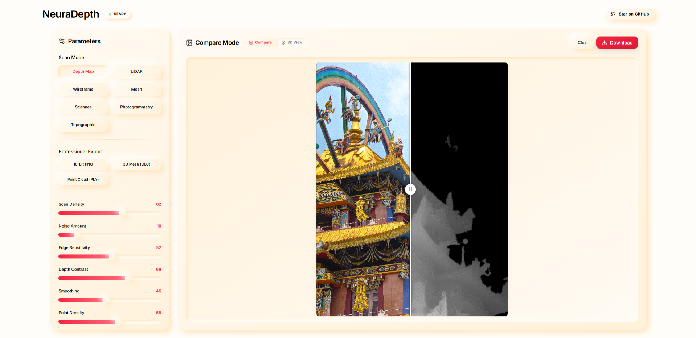
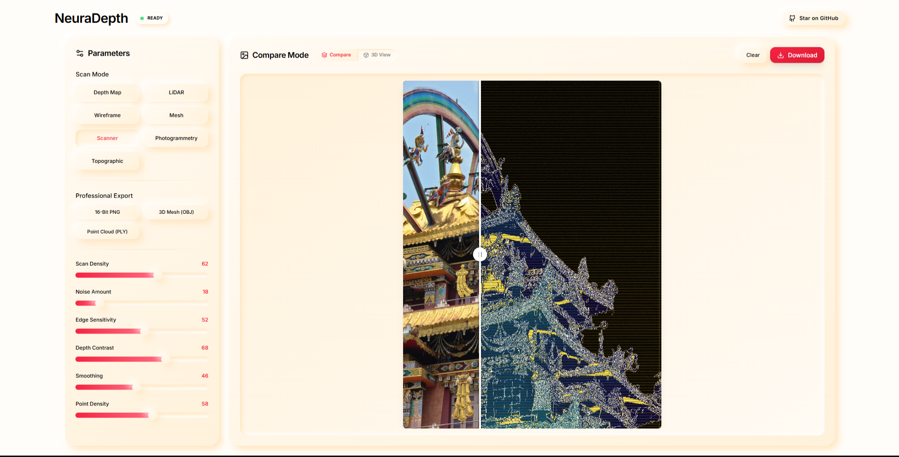
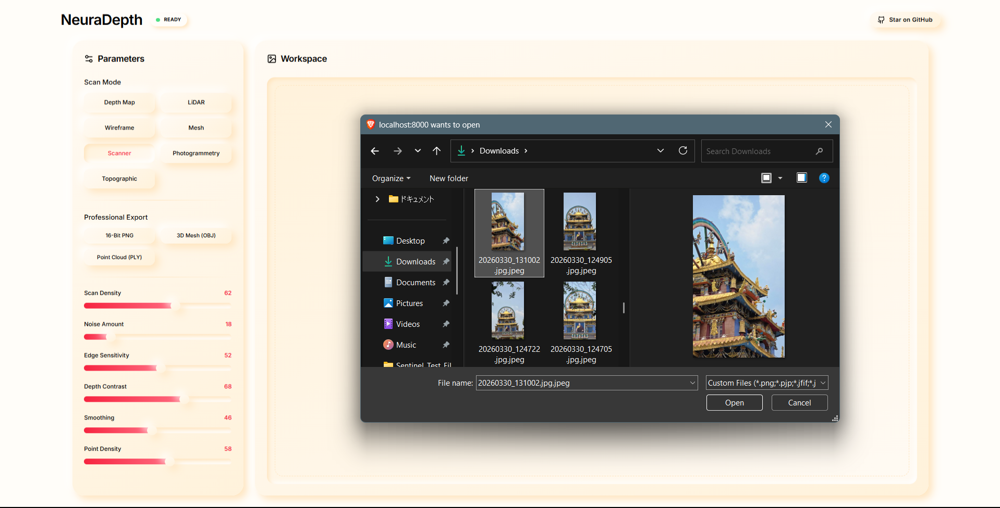
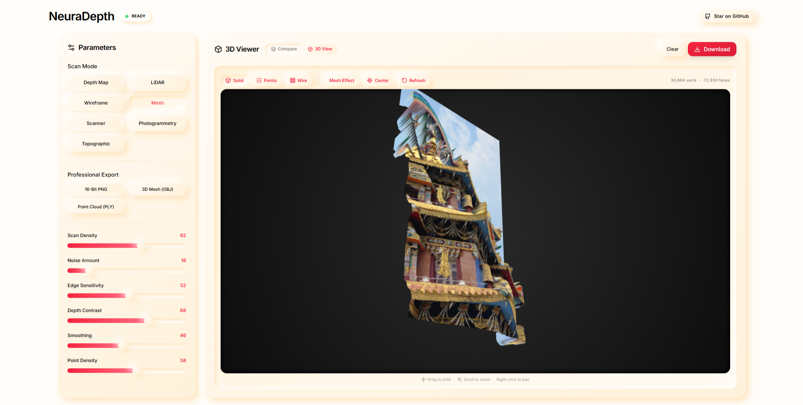
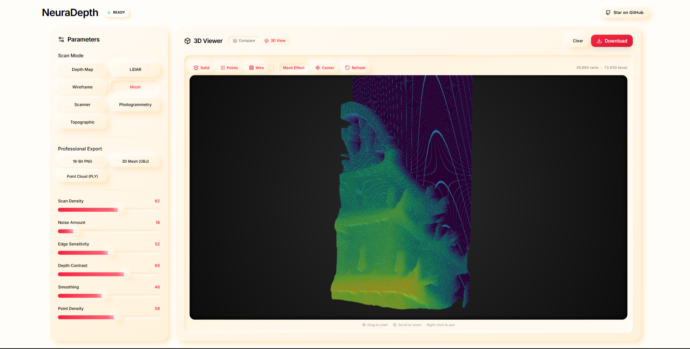
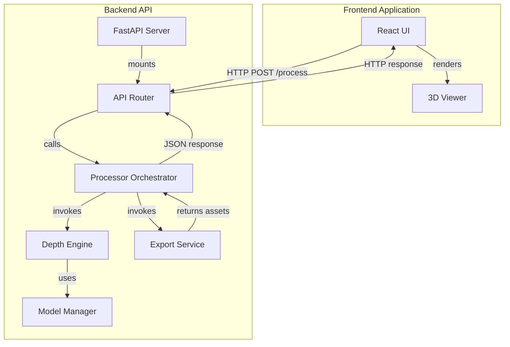

<div align="center">

# NeuraDepth

### AI-Powered Depth Estimation, 3D Reconstruction & Interactive Visualization

Generate high-quality depth maps, point clouds, and textured 3D meshes from ordinary 2D images using state-of-the-art deep learning.


</div>

---

# Overview

NeuraDepth is a modern AI-powered desktop web application that transforms ordinary RGB images into accurate depth maps, interactive point clouds, and textured 3D meshes.
Powered by **PyTorch**, **Depth Anything V2**, **FastAPI**, **React**, and **Three.js**, NeuraDepth performs all processing locally, providing high-performance depth estimation without relying on cloud services or external APIs.

Designed for developers, researchers, artists, and students, the application combines professional AI inference with an intuitive interface and real-time visualization.

---

# Preview

<p align="center">

</p>

---

# Features

## AI Depth Estimation
- Depth Anything V2 deep learning model
- High-quality monocular depth prediction
- GPU acceleration using PyTorch
- CPU fallback support
- Offline execution
- High-resolution depth generation

---

## Interactive 3D Visualization

- Real-time mesh rendering
- Interactive point cloud viewer
- Wireframe visualization
- Orbit controls
- Zoom & pan
- Automatic camera centering
- High-performance Three.js rendering

---

## Compare Mode

Compare the original image with the generated depth map using an interactive comparison slider.

<p align="center">

</p>

---

## Professional Scan Modes

| Mode | Description |
|------|-------------|
| **Depth Map** | AI-generated grayscale depth estimation |
| **LiDAR** | Simulated LiDAR point cloud |
| **Mesh** | Polygon mesh reconstruction |
| **Wireframe** | Surface topology visualization |
| **Photogrammetry** | Reconstruction artifact simulation |
| **Scanner** | Futuristic scan visualization |
| **Topographic** | Terrain contour visualization |

---

## Interactive Controls

NeuraDepth includes adjustable processing parameters:

- Scan Density
- Point Density
- Noise Amount
- Edge Sensitivity
- Depth Contrast
- Smoothing
- Mesh Refresh
- Compare Mode
- 3D View Toggle

Every parameter updates the generated visualization in real time.

---

## Professional Export Formats

Export generated data for use in professional 3D applications.

Supported formats

- 16-bit PNG
- OBJ Mesh
- PLY Point Cloud

Compatible with

- Blender
- Unreal Engine
- Unity
- Autodesk Maya
- MeshLab

---

# Screenshots

## Upload Workspace

<p align="center">

</p>

---

## Compare Mode

<p align="center">

</p>

---

## Interactive Mesh Viewer

<p align="center">

</p>

---

## Depth Visualization

<p align="center">

</p>

---

# Architecture

```
                  User

                    │

          React + TypeScript

                    │

        REST API + WebSockets

                    │

               FastAPI

                    │

      OpenCV + NumPy + PyTorch

                    │
              Depth Anything V2

                    │

      Depth Reconstruction Engine

                    │

   Mesh / Point Cloud Generation

                    │

       Three.js 3D Visualization
```

---

# Technology Stack

## Frontend

- React 18
- TypeScript
- Vite
- Tailwind CSS
- Framer Motion
- Three.js
- React Three Fiber
- React Drei
- Lucide React

---

## Backend

- Python
- FastAPI
- Uvicorn
- PyTorch
- OpenCV
- NumPy
- Pillow

---

## AI
- Depth Anything V2

---

## Communication

- REST API
- WebSockets

---

# Project Structure

```text
NeuraDepth/
│
├── backend/
│   ├── app/
│   ├── services/
│   ├── models/
│   └── requirements.txt
│
├── frontend/
│   ├── public/
│   │   ├── screenshot.png
│   │   ├── upload-workspace.png
│   │   ├── compare-mode.png
│   │   ├── mesh-view.png
│   │   └── depth-view.png
│   │
│   ├── src/
│   ├── package.json
│   └── vite.config.ts
│
├── Dockerfile
├── docker-compose.yml
├── start.bat
├── README.md
└── LICENSE
```

---

# Installation

## Clone Repository

```bash
git clone https://github.com/forex-911/NeuraDepth.git

cd NeuraDepth
```

---

## Backend Setup

```bash
cd backend

python -m venv .venv
```

### Windows

```bash
.venv\Scripts\activate
```

### Linux/macOS

```bash
source .venv/bin/activate
```

Install dependencies

```bash
pip install -r requirements.txt
```

Run server

```bash
uvicorn app.main:app --reload
```

---

## Frontend Setup

```bash
cd frontend

npm install

npm run dev
```

Open

```
http://localhost:5173
```

---

# Docker

## Pull Image

```bash
docker pull forex911/neuradepth
```

---

## Run Container

```bash
docker run -p 8000:8000 forex911/neuradepth
```

---

## Build Locally

```bash
docker build -t neuradepth .
```

---

# API
### Generate Depth Scan

```
POST /scan
```

Accepts image and processing parameters as form data. Returns the generated file bytes directly.

---

### WebSocket

```ws://localhost:8000/ws/progress
```

Streams

- Progress updates
- Processing status
- Completion events
- Error messages

---

# Performance

| Hardware | Processing Time |
|------------|----------------:|
| RTX 4090 | <1 second |
| RTX 3060 | ~1 second |
| RTX 3050 | ~1–2 seconds |
| GTX 1650 | ~2–4 seconds |
| CPU | ~8–20 seconds |

---

# Why NeuraDepth?

- Fully Offline Processing
- No Cloud Dependencies
- GPU Accelerated
- Interactive 3D Rendering
- Modern React Interface
- Production-Ready FastAPI Backend
- Docker Ready
- Open Source
- Cross Platform

---

# Roadmap

- [x] AI Depth Estimation
- [x] Interactive 3D Viewer
- [x] Compare Mode
- [x] Mesh Generation
- [x] OBJ Export
- [x] PLY Export
- [x] Docker Support
- [ ] ONNX Runtime
- [ ] TensorRT Optimization
- [ ] Video Depth Estimation
- [ ] Batch Processing
- [ ] Multi-GPU Support
- [ ] Cloud Deployment Templates

---

# Contributing

Contributions are welcome.

1. Fork the repository.

2. Create a feature branch.

```bash
git checkout -b feature/my-feature
```

3. Commit your changes.

```bash
git commit -m "Add new feature"
```

4. Push the branch.

```bash
git push origin feature/my-feature
```

5. Open a Pull Request.

---

# License

This project is licensed under the **MIT License**.

---

# Author

**Forex911**

AI & Full Stack Developer

GitHub: https://github.com/forex911

Docker Hub: https://hub.docker.com/r/forex911/neuradepth

---

<div align="center">

### ⭐ If you find NeuraDepth useful, please consider starring the repository.

Built with ❤️ using React, FastAPI, PyTorch, and Three.js.
</div>

## Architecture Diagram



<details>
<summary>Mermaid Source</summary>


</details>
